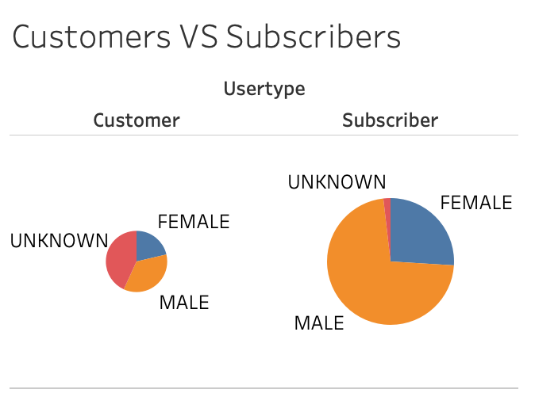
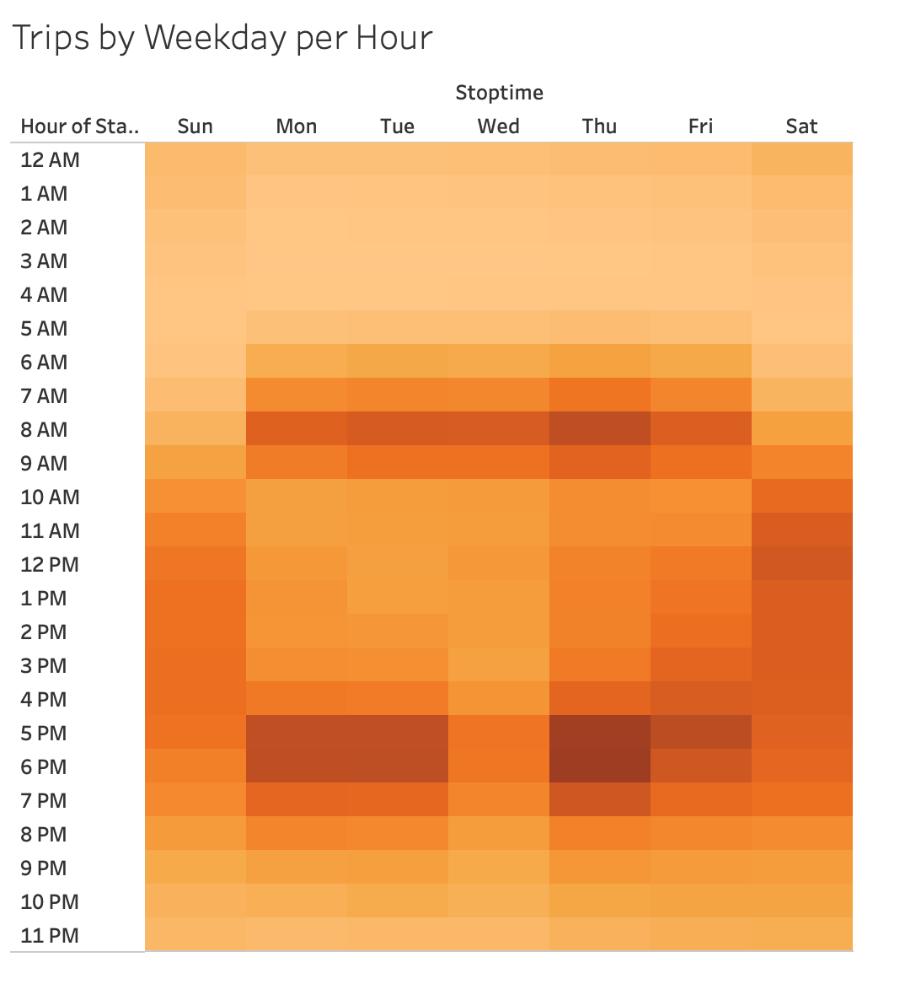
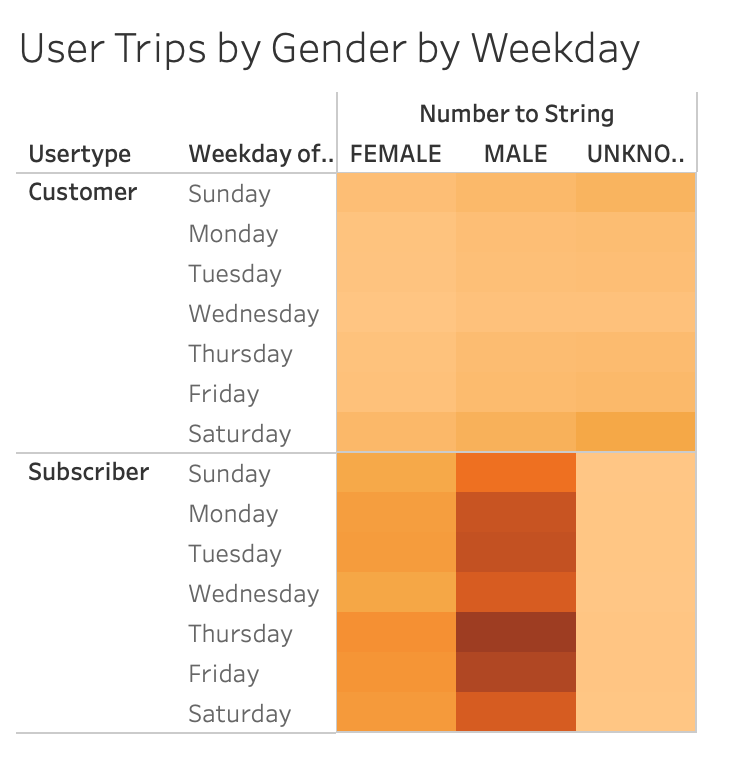
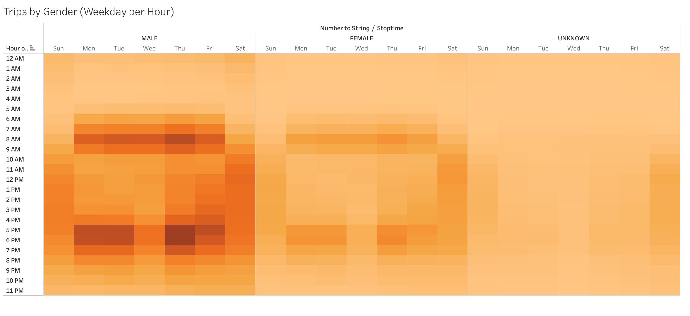
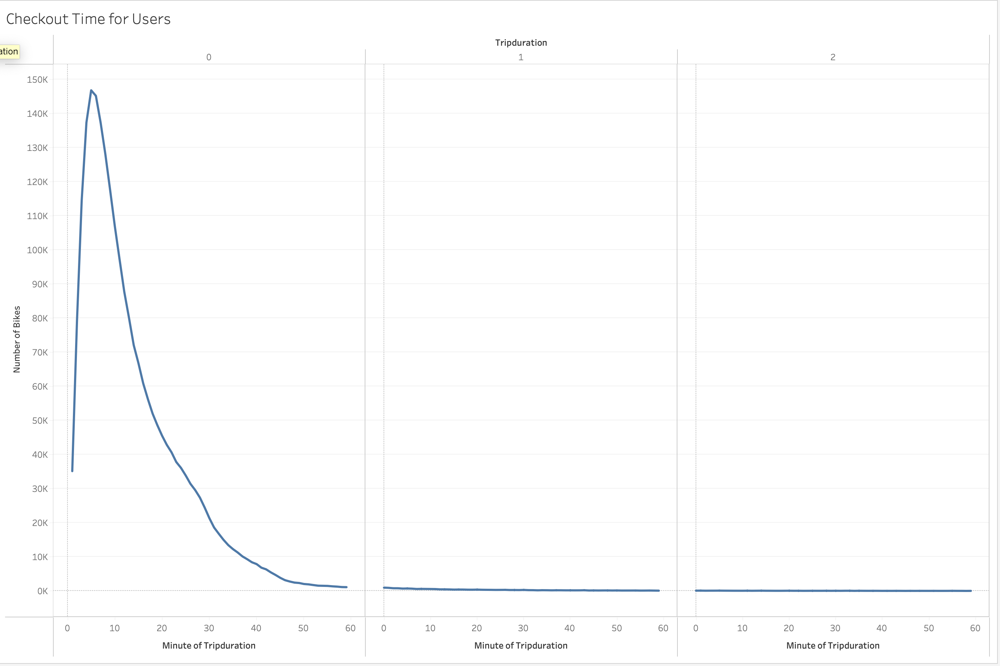
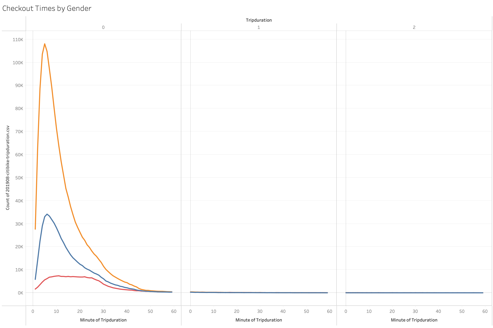
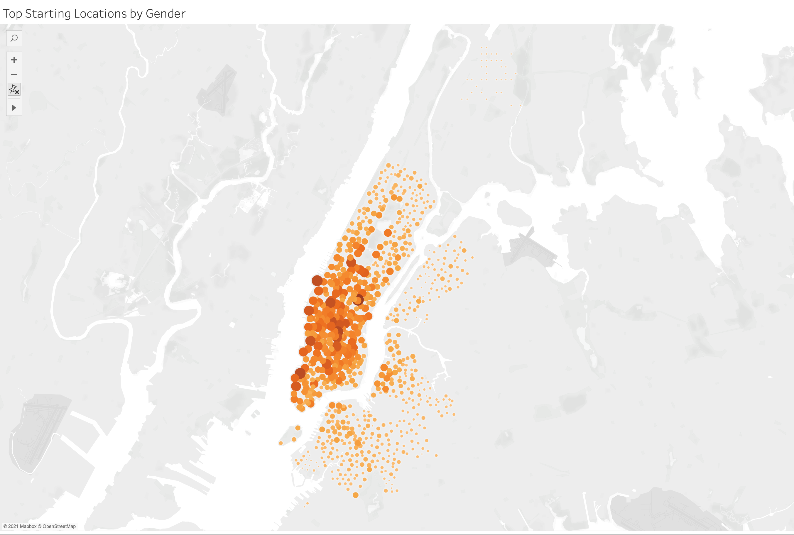

# Bikesharing in New York City

## Overview
In this analysis we reviewed and summarized the August 2019 bike sharing data provided thru the citi bikesharing website.  The purpose was to summarize and present to investors the profitability of creating a similar business in Ohio. 

## Results

In a city known for their tourists, a majority of the users of bikesharing are subscribers.  The assumption is that these are workers in the city.  In addition a majority of the subscribers are male.  For customers we assume that these people are tourists and as such it is harder to identify the primary gender users.

The busiest days are during the workweek primarily Monday, Tuesday and Thursday with the peak hours of 5:00 pm to 6:00 pm and 8:00 am.

For both male and female subscribers the busiest days are Thursday, Monday and Tuesday.  This slide breaks down the previous slide to make it more obvious that male subscribers use the service daily at a higher rate then other subscribers.  It is also noteworthy that for customers, Saturday and Sunday are their days to use the service

This consolidates the Trips by Weekday, by Gender and by hour.  Overall customers and subscribers males are the dominant customer.

146K trips last a duration of 5 minutes.  

Regardless of the gender a majority of the rides peak at five to six minutes

The majority of rides start in urban areas.  In addition this is very similar across all genders

## Summary

The ridesharing business relies heavily on the people who need to commute within urban areas between points that are less than 20 minutes to bike too.  Any duration over 20 minutes in biking and the business drops in use.  

In addition to the tables requested in the module I provided two additional images that highlight the importance that subscribers play to the business and that the urban setting is important as trip duration in less than 20 minutes prior to business falling off.

To see the entire Dashboard please see:

[link to dashboard](https://public.tableau.com/app/profile/katrina.holcomb/viz/BikesharingChallenge_16315410140640/BikeSharingasaBusiness?publish=yes)

